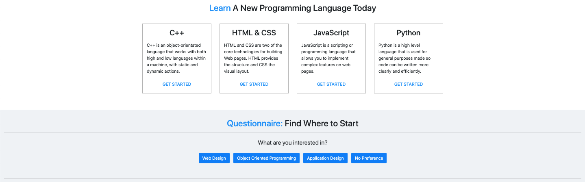

<!-- PROJECT SHIELDS -->
[![LinkedIn][linkedin-shield]](https://www.linkedin.com/in/raphaelval/)
[![YouTube][youtube-shield]](https://youtu.be/n9UaKoFPJbs)
[![GitHub][reportbug-shield]](https://github.com/raphaelval/OWLcode/issues)

<!-- PROJECT LOGO -->
 

  
   

<h2 align="center">OWLcode</h2>
  

    Full LAMP Stack Web Application that Teaches Beginners How to Code
     
  

<!-- TABLE OF CONTENTS -->

  
Table of Contents

  <ol>
    <li>
      <a href="#about-the-project">About The Project</a>
      <ul>
        <li><a href="#built-with">Built With</a></li>
      </ul>
    </li>
    <li>
      <a href="#features">Features</a>
      <ul>
        <li><a href="#responsive">Responsive</a></li>
        <li><a href="#home-page">Home Page</a></li>
        <li><a href="#sign-up-and-login">Sign Up and Login</a></li>
        <li><a href="#profile">Profile</a></li>
        <li><a href="#main-content">Main Content</a></li>
      </ul>
    </li>
    <li><a href="#design-process">Design Process</a>
      <ul>
        <li><a href="#requirements">Requirements</a></li>
        <li><a href="#diagrams">Diagrams</a></li>
      </ul>  
    </li>
    <li><a href="#contact">Contact</a></li>
    <li><a href="#owlcode-team">OWLcode Team</a></li>
  </ol>

<!-- ABOUT THE PROJECT -->
## About The Project

OWLcode is a web application that would be useful to Computer, Electrical Engineering and Computer Science (CEECS) students to access information and start learning how to code. It would also provide users a personalized profile based on their needs and interests. We were able to provide a secure sign up and login system, a topic questionnaire, and information about different programming languages. A user can create a personalized profile, use a questionnaire that suggests topics based on their interests, and view information and videos to start learning how to program.

 

 

### Built With

* HTML
* CSS
* PHP
* MySQL
* JavaScript
* [Bootstrap](https://getbootstrap.com)

(<a href="#top">back to top</a>)

<!-- Features -->
## Features

### Responsive
 

 

By utilizing Bootstrap's Grid and Navigation Bar, this allowed us to be more mobile friendly to any screen size. With the custom layout of our website, we had to test various screen sizes to implement CSS media screen sizing.

(<a href="#top">back to top</a>)

### Home Page

The home page was designed to be a hub for the web app. Everything about the website, quick links, and contact is placed in one page for users. Its features include: Navigation Bar, Search, About, Quick Links, and Contact.

  
Navigation Bar

 

 

We developed the navigation bar to include everything needed for complete funcitonality of the website. The logo is placed on the left and is used as the home button. The menu options are placed in the middle and all account functionality is placed on the right.

  
Search

 

 

The search functionality is placed at the top for users to quickly find what they are looking for. The input value is taken and will output results on another page based on matching keywords for the topics.

  
About

 

 

The about section gives the user a feel of who we are and information about the goal of the website. By having a header placed as the majority of the screen, it welcomes the user without loading them with too much information. This gives the user a chance to explore around the website to learn more.

  
Quick Links

 

 

The quick links section gives the user access to our main content with small descriptions. Instead of having to navigate back up to the navigation bar, we provide links if they are interested to start learning right away. The questionnaire is also located there if the user is not sure of where to start in their programming journey

  
Contact

 

 

Our contact information is placed in the footer of every page so users can contact us with any questions. Social media links are also included to learn more about us and for any updates.

(<a href="#top">back to top</a>)

### Sign Up and Login

 

 

The sign up and login features were developed using PHP and MySQL. Some of its features include: Error Checking, Password Encryption, and Email Confirmation.

 

 

During error checking, we check for duplicate usernames and emails, minimum characters for username and password, special characters in username, atleast one number in password, and atleast one capital letter in password.

 

 

Password encryption using hashing has also been implemented for secure login. The database shows the password in its encrypted form.

(<a href="#top">back to top</a>)

### Profile

Profile data is retrieved when accessing the account page. Here, the user can change their password and delete their account if needed.

 

 

To change the password, for security purposes, the user must enter their current password in order to create a new password.

 

 

To delete the user account, the user must enter the case-sensitive word 'DELETE' to prevent any deletion mistakes.

(<a href="#top">back to top</a>)

### Main Content
 

 

For the main content of the web application, we chose topics such as HTML & CSS, Python, JavaScript, and C++. Each page includes an intro, information, and outro section.

The intro section includes a welcome section with a brief description about the programming language. It also includes a video for users to get a better understanding if needed.

A rating system is also included and any new rating is saved to the database. Each time the page is loaded, the total ratings in the database are averaged out of 5 stars.

The information section includes short tutorials of the basics of the programming language. This shows everything they need in order to start a learning career in a specifc language.

The outro section finishes off with videos that the user can continue with that share more difficult topics within that language.

(<a href="#top">back to top</a>)

<!-- Design Process -->
## Design Process

The design process followed steps like in a typical software engineering project. Requirements were given before the project started which allowed us to have a plan-driven and agile approach. The requirements are stable and were given clearly with room for creativity in designing the system features. The agile approach allows us to easily implement new functionality to features.

### Requirements

User

<ul>
<li>Users shall be able to sign up and log in, confirm personal information, fill out a background questionnaire, and have access to the database of topics.</li>
<li>Users shall be able to view and browse presented topics based on their background questionnaire.</li>
<li>Users shall be able to print, view videos, and rate content.</li>
</ul>

System

<ul>
<li>The system shall be able to add and remove users and shall have secure login.</li>
<li>A list of topics shall be generated by the background questionnaire for the user to select.</li>
<li>Access for uploading, removing, and updating content shall be only for authorized users.</li>
<li>Credentials shall be sent to the user once sign up is completed.</li>
</ul>

(<a href="#top">back to top</a>)

### Diagrams

UI

Use-Case

A visual representation of how a user interacts with the sign up and login and how it directs them to the questionnaire. There are tasks that are executed by the system such as password encryption, password verification, and login errors.

A visual representation of how a user interacts with the topics feature of the web app. Once a user is signed up, they can browse and have access to all their topics. Other features are displayed in which a user can choose to do such as rate, print content, and view videos.

Sequence

Activity

Database

(<a href="#top">back to top</a>)

<!-- CONTACT -->
## Contact

Raphael Valente - [![LinkedIn][linkedin-shield]](https://www.linkedin.com/in/raphaelval/) - raphaelvval@gmail.com

Project Link: [https://github.com/raphaelval/OWLcode](https://github.com/raphaelval/OWLcode)

(<a href="#top">back to top</a>)

<!-- Team -->
## OWLcode Team

* Raphael Valente (Lead Software Developer/Project Manager)
* Tanis Anderson (Software Developer)
* Eric Thach (Software Developer)
* Patryk Wysocki (Software Developer)
* Bellinda Lominy (Software Developer)

(<a href="#top">back to top</a>)

<!-- MARKDOWN LINKS & IMAGES -->
<!-- https://www.markdownguide.org/basic-syntax/#reference-style-links -->
[contributors-shield]: https://img.shields.io/github/contributors/github_username/repo_name.svg?style=for-the-badge
[contributors-url]: https://github.com/github_username/repo_name/graphs/contributors
[forks-shield]: https://img.shields.io/github/forks/github_username/repo_name.svg?style=for-the-badge
[forks-url]: https://github.com/github_username/repo_name/network/members
[stars-shield]: https://img.shields.io/github/stars/github_username/repo_name.svg?style=for-the-badge
[stars-url]: https://github.com/github_username/repo_name/stargazers
[issues-shield]: https://img.shields.io/github/issues/github_username/repo_name.svg?style=for-the-badge
[issues-url]: https://github.com/github_username/repo_name/issues
[license-shield]: https://img.shields.io/github/license/github_username/repo_name.svg?style=for-the-badge
[license-url]: https://github.com/github_username/repo_name/blob/master/LICENSE.txt
[linkedin-shield]: https://img.shields.io/badge/-LinkedIn-black.svg?style=for-the-badge&logo=linkedin&colorB=555
[youtube-shield]: https://img.shields.io/badge/-View_Demo-black.svg?style=for-the-badge&logo=youtube&colorB=fe0e00
[reportbug-shield]: https://img.shields.io/badge/-Report_Bug-black.svg?style=for-the-badge&logo=github&colorB=f48225
[linkedin-url]: https://linkedin.com/in/linkedin_username
[product-screenshot]: images/screenshot.png
